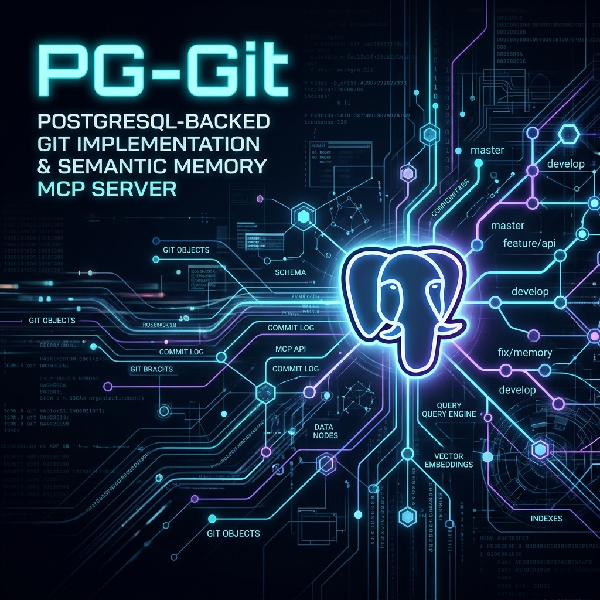

# PG-Git (Semantic Memory MCP)

<p align="center">
  
</p>

A persistent, PostgreSQL-backed repository management system and semantic memory MCP server. Instead of storing Git objects loosely on the file system, PG-Git stores the entire Directed Acyclic Graph (DAG) natively in PostgreSQL, complete with automatically generated, temporally-decayed semantic vector embeddings for AI IDEs.

[](https://badge.fury.io/js/pg-git)
[](https://opensource.org/licenses/MIT)


## 🧠 Why PG-Git?

In the standard AI coding agent ecosystem, searching codebases relies on rigid grep searches or expensive AST parsing. PG-Git fundamentally changes this by bridging Git directly with Vector Databases:
1. **Semantic Code Search**: Find code based on what it *does*, not just its syntax.
2. **Exponential Temporal Decay**: PG-Git mathematically decays older vectors. Your agent will prioritize code you wrote yesterday over highly similar dead code written 6 months ago.
3. **Local-First Purity**: No cloud APIs. It uses Ollama with `nomic-embed-text` for 100% private, on-device vectorization.
4. **ACID Compliant**: Native transactions ensure complete safety for multi-node accessibility and concurrent AI swarm agents.

## ⚠️ Not a Replacement for Git

It is critical to understand that PG-Git **does not replace Git** or services like GitHub/GitLab. It does not handle branch merging, rebasing, or pull requests. 

Instead, PG-Git is an **agentic augmentation layer**. You continue to use standard Git for your human-facing source control and team collaboration. PG-Git sits alongside it in your workflow, automatically ingesting your standard Git history to provide your AI agents with a mathematically optimized, semantically searchable clone of your codebase.

## 🤝 The DBOS Agentic Ecosystem

This project is a dedicated node within the **Krusch DBOS Agentic Ecosystem**. The architecture moves away from monolithic local applications into a highly modular, distributed swarm of specialized Model Context Protocol (MCP) servers.

- **[Krusch DBOS MCP](https://github.com/kruschdev/krusch-dbos-mcp)**: The central Orchestrator and Postgres-backed state machine.
- **[Krusch Agentic Proxy](https://github.com/kruschdev/krusch_agentic_proxy)**: The Intelligence Layer (LLM Waterfall Router).
- **[PG-Git MCP](https://github.com/kruschdev/pg-git-mcp)**: Source Control Boundary (Code Editing & Commits).
- **[Krusch Infra MCP](https://github.com/kruschdev/krusch-infra-mcp)**: System Ops Boundary (Docker & SRE).
- **[Signet MCP](https://github.com/kruschdev/signet)**: Communications Boundary (Email & Calendar).
- **[Krusch Memory MCP](https://github.com/kruschdev/krusch_memory_mcp)**: Episodic History Boundary (Project-isolated Temporal Memory).

> 🗺️ **Want to see the big picture?** Read the [Ecosystem Blueprint](https://github.com/kruschdev/krusch-dbos-mcp/blob/main/ECOSYSTEM.md) for a complete diagram of how these boundaries fit together.

## 🤝 The Agentic Brain (Synergy with Krusch Memory MCP)

PG-Git is designed to be used in tandem with the **[Krusch Memory MCP](https://github.com/kruschdev/krusch_memory_mcp)** to solve the "Goldfish Memory" problem inherent to native AI IDEs (like Antigravity, Claude, or Codex). While they both provide semantic memory to your AI agents, they serve two distinct halves of the "Agentic Brain":

- **Krusch Memory MCP (The "Why")**: Acts as the episodic and procedural memory. It stores the *intent*—the architectural decisions, user preferences, bugs encountered, and high-level project goals.
- **PG-Git (The "What" and "How")**: Acts as the structural and semantic memory of your code. It provides the actual implementation details, file structures, and algorithms.

**Infinite Continuity**: By running both MCPs simultaneously, your agent can cross-reference the *intent* (Krusch Memory) with the *implementation* (PG-Git). It remembers *why* you chose a specific architecture, and instantly sees *how* to implement it, creating a deeply contextualized and autonomous coding workflow that persists across infinite sessions.

## ⚡ Quick Start

You **must** have [Ollama](https://ollama.com/) running with the `nomic-embed-text` model pulled:
```bash
ollama run nomic-embed-text
```

**1. Install Dependencies & Migrate**
You will need a running PostgreSQL instance with `pgvector` enabled.
```bash
npm install
cp .env.example .env
# Edit .env with your PostgreSQL credentials
node db/migrate.js
```

**2. Import Your GitHub History**

> [!WARNING]
> **Choose your embedding model carefully.** You must set your preferred model (via the UI Settings tab or `.env`) *before* running your first import or snapshot. If you change models later, vector dimensions will collide and you will be forced to manually wipe the database and re-embed all repositories from scratch.

You can instantly import any local `.git` repository. PG-Git will natively parse the Git history, generate semantic embeddings for all blobs, and securely deduplicate them into PostgreSQL:
```bash
npm run import
```

**3. Add to your Agent / IDE Configuration (e.g. `mcp_config.json`):**
```json
{
  "mcpServers": {
    "pg-git-mcp": {
      "command": "node",
      "args": ["/absolute/path/to/pg-git/server/mcp.js"],
      "env": {
        "OLLAMA_URL": "http://localhost:11434",
        "EMBED_MODEL": "nomic-embed-text"
      }
    }
  }
}
```

**4. Start the Web UI (Optional)**
PG-Git includes a sleek, dual-pane IDE interface for browsing your semantic repositories.
```bash
npm run dev
```

---

## 🚀 Real-World Usage Examples

To effectively use PG-Git, simply speak to your IDE agent normally. It will use the MCP tools (`krusch_context_search_code`, `pg_git_list_repos`, `pg_git_read_tree`, `pg_git_read_blob`) to interface with the database.

**Example 1: Finding specific logic**
> **You:** "Where do we handle the temporal decay for the memory MCP?"
> **Agent:** *[Calls `krusch_context_search_code`]* "I found the logic in `server/index.js` inside the `krusch-memory-mcp` repo. It uses the `exp(-DECAY_RATE * age_in_days)` formula."

**Example 2: Reading a repository tree**
> **You:** "What is the folder structure for the pg-git project?"
> **Agent:** *[Calls `pg_git_read_tree`]* "Here is the root directory structure..."

### How Does Temporal Decay Work?
When calling `krusch_context_search_code`, PG-Git returns the highest cosine-similarity matches. However, it applies **Exponential Temporal Decay** based on the blob's `last_seen_at` timestamp. If you have two very similar pieces of code, the *newer* one will have a significantly higher score, preventing your agent from hallucinating based on outdated implementations.

---

## 🤖 The Autonomous Agent Workflow (`/close`)

You can integrate PG-Git into your agentic workflow to ensure your semantic memory is always up to date. 

Whenever you step away from a task, tell your agent to run the snapshot script. The agent will autonomously:
1. Hash the current project folder into Git Blobs and Trees.
2. Ping Ollama to embed any new or modified files.
3. Commit the state directly into PostgreSQL.

Command to run:
```bash
npm run snapshot
```

---

## 🛠️ Configuration & Environment Variables

| Variable | Description | Default |
|----------|-------------|---------|
| `PORT` | Express server port. | `4890` |
| `DB_HOST` | PostgreSQL Host address. | `localhost` |
| `DB_PORT` | PostgreSQL Port. | `5434` |
| `DB_NAME` | Database Name. | `postgres` |
| `DB_USER` | Database User. | `postgres` |
| `DB_PASSWORD` | Database Password. | *(empty)* |
| `OLLAMA_URL` | The endpoint for your local Ollama instance. | `http://localhost:11434` |
| `EMBED_MODEL`| The Ollama text-embedding model to use. | `nomic-embed-text` |

## License
MIT License. Created by [kruschdev](https://github.com/kruschdev).
